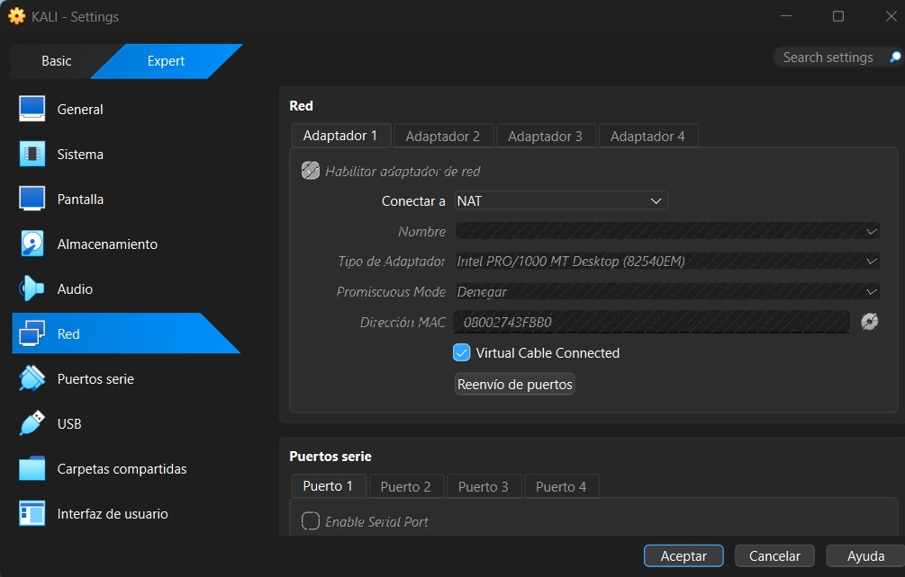
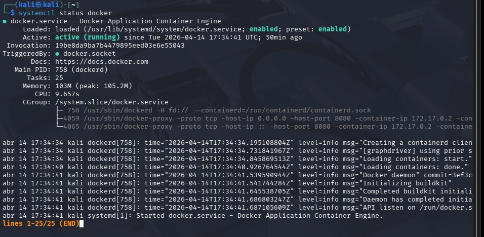
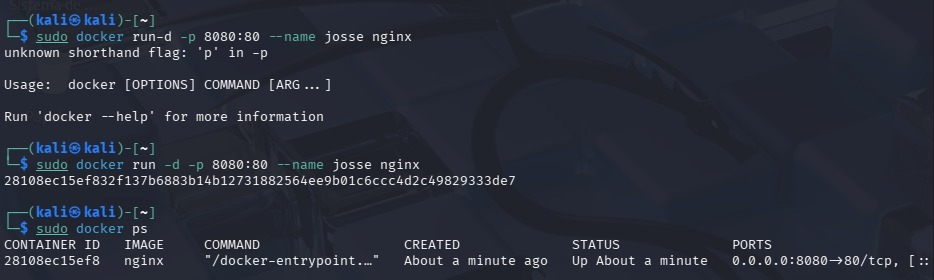
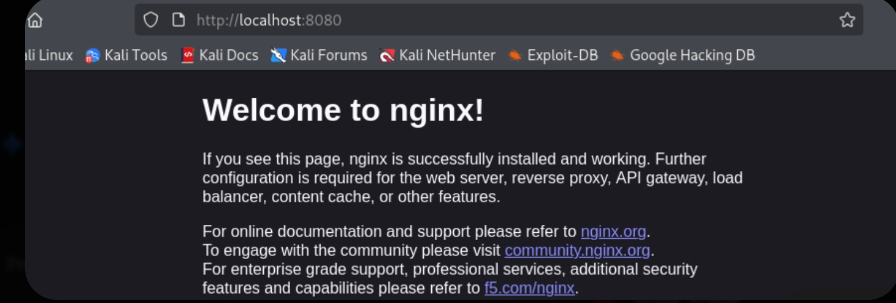
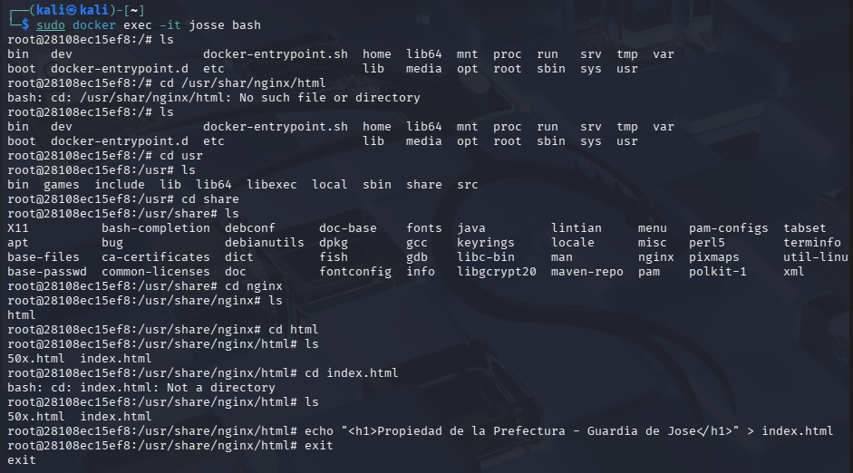
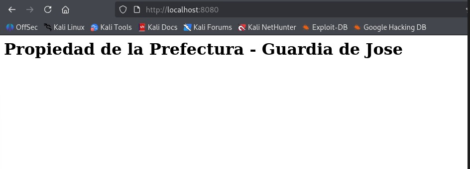
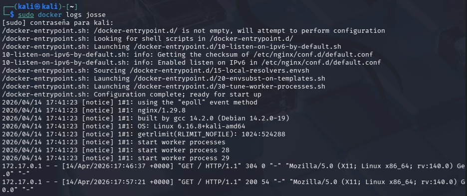

# LAB-DOCKER-NGINX-CIBERSECURITY-
Laboratorio experimental, donde se usa la herramienta docker desde un kali linux, en una maquina virtual.

1. Preparación del Entorno

Descripción: Configuración del adaptador NAT en VirtualBox y validación del dominio de Docker en Kali Linux. Demuestra que el sistema está listo y el servicio habilitado (enabled).

2. Despliegue del Activo

Descripción: Creación del contenedor Nginx con mapeo de puertos. El puerto 8080 queda expuesto para auditoría.

Troubleshooting de sintaxis, Se identificó que Docker no reconocía el comando por falta de espacios. Se corrigió y se validó la ejecución."

3. Verificación de Disponibilidad

Descripción: Acceso inicial exitoso al servidor. Se confirma que el servicio es funcional y responde a peticiones HTTP externas.

4. Administración e Intervención 

Descripción: Este es el núcleo técnico. Muestra cómo se utilizo  "exec -it" para navegar el sistema de archivos de Linux, alterando "index.html".
El resultado es el mensaje: "Propiedad de la Prefectura - Guardia de Jose".

5. Auditoría y Análisis Forense

Identificación del Actor: Se registra la IP de origen 172.17.0.1 (Docker Bridge), lo que permite rastrear desde qué interfaz se originó el tráfico.

Análisis de Códigos de Respuesta:

HTTP 304 (Not Modified): Indica que en la primera solicitud el navegador utilizó el caché, ya que el archivo index.html no había sufrido cambios.

HTTP 200 (OK): Registra el éxito de la petición tras la modificación del contenido. El servidor entregó el nuevo recurso correctamente.

Detección de Alteración (Data Size):

Se observa que la respuesta exitosa tiene un peso de 54 bytes. En una investigación real, un cambio repentino en el tamaño de los paquetes servidos (Payload) es un indicador de compromiso (IoC) que sugiere que el contenido original fue reemplazado o inyectado con código malicioso.

Huella Digital del Navegador: El User-Agent revela el uso de Mozilla/5.0 en un sistema Linux x86_64 (nuestra máquina Kali), permitiendo perfilar al usuario que interactuó con el activo.

6. Higiene del Sistema

 

Descripción: Cierre del ciclo de vida del contenedor mediante stop y rm. Muestra responsabilidad en la gestión de recursos del sistema.
